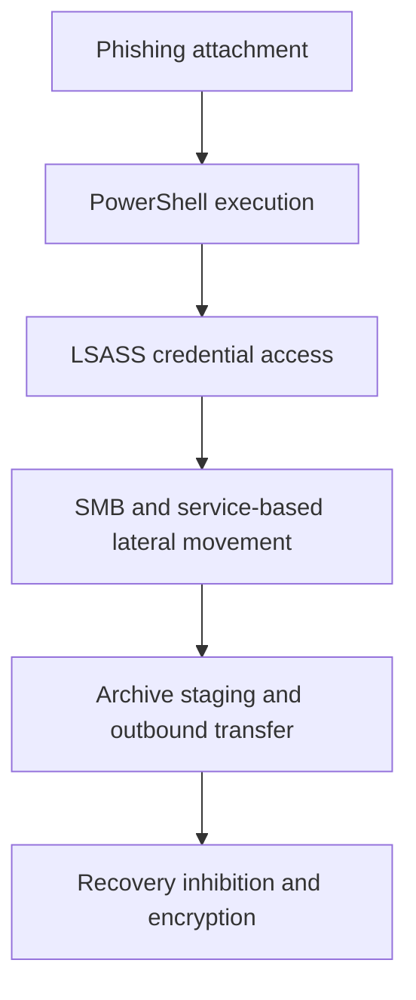
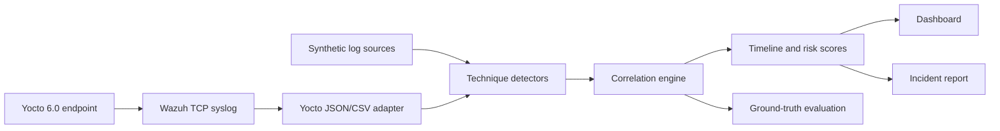

# Operation ShadowVault


An end-to-end SOC and DFIR portfolio lab that reconstructs a simulated ransomware intrusion from multi-source telemetry. The project generates a reproducible dataset, applies MITRE ATT&CK-mapped detections, correlates evidence into an incident timeline, ranks affected assets, evaluates the rules against labelled ground truth, and generates an analyst-ready case report.

> This is a safe defensive simulation. It contains log records describing attacker behavior; it does not contain exploit, credential-dumping, persistence, or encryption functionality.

## What this project demonstrates

- Detection engineering across Windows Security, Sysmon, firewall, and file-system telemetry.
- Alert correlation across five attack stages and multiple hosts.
- MITRE ATT&CK mapping for 11 core techniques plus three optional embedded-endpoint detections.
- SOC triage through severity, evidence, affected-account, and asset context.
- DFIR reporting with IOCs, containment priorities, recovery actions, and analyst confidence.
- Reproducibility through a seeded data generator, labelled ground truth, automated tests, and CI.
- Investigation visualization through an interactive Streamlit dashboard.
- Recruiter-supplied CSV analysis with schema validation and in-memory processing.
- Yocto 6.0 LTS image customization, Linux audit policy, Wazuh/syslog forwarding, and IoT triage.

## Attack story



The fictional organization, Meridian Precision Manufacturing, is compromised after an Accounts Payable user opens a malicious Office attachment. The activity progresses from execution on `WKS-FIN-07` to credential theft, privileged lateral movement, attempted data exfiltration, shadow-copy deletion, event-log clearing, and mass file renaming.

## Detection coverage

| Stage | ATT&CK coverage | Primary evidence |
|---|---|---|
| Initial access | T1566.001, T1204.002, T1059.001 | Office process spawning obfuscated PowerShell |
| Credential access | T1003.001 | Sysmon Event 10 access to LSASS plus dump artifact |
| Lateral movement | T1021.002, T1569.002 | Network logons across hosts and remote service creation |
| Exfiltration | T1560, T1041 | Archive utility execution and unusually large outbound transfers |
| Impact and anti-forensics | T1490, T1486, T1070.001 | Shadow deletion, rename burst, ransom note, log clearing |
| Embedded endpoint (optional) | T1110.001, T1548.003, T1562.001 | SSH failures, privileged execution, telemetry configuration changes |

## Verified sample results

| Result | Value |
|---|---:|
| Raw log events | 219 |
| Correlated alerts | 27 |
| Attack stages reconstructed | 5 |
| Named assets with alert evidence | 5 |
| Highest-risk asset | `SRV-FILE-01` |
| Synthetic benchmark precision / recall / F1 | 1.00 / 0.931 / 0.9643 |

The evaluation is an exact-match benchmark against the labelled, deterministic lab scenario. The v1 rules generate 27 core alerts while intentionally missing a distributed password spray and an aggregated low-volume exfiltration attempt. Those two controlled false negatives are explicit detection-engineering backlog items. The optional Yocto sample is tested separately and does not change this benchmark. These figures are not claims of production accuracy.

## Architecture



```text
ShadowVault/
├── .github/workflows/ci.yml       # GitHub Actions test matrix
├── data/
│   ├── raw/                       # four generated telemetry sources
│   ├── samples/                   # optional normalized Yocto telemetry
│   ├── ground_truth/              # labelled expected detections
│   └── processed/                 # timeline, scores, summary, metrics
├── docs/
│   ├── MITRE_ATTACK_MAPPING.md
│   ├── PORTFOLIO_GUIDE.md
│   └── YOCTO_INTEGRATION.md
├── meta-shadowvault/              # Yocto image, audit policy, syslog forwarding
├── notebooks/ShadowVault_Analysis.ipynb
├── reports/incident_report.md
├── src/
│   ├── detectors/                 # five technique-scoped detectors
│   ├── correlation_engine.py
│   ├── evaluate.py
│   ├── log_generator.py
│   ├── report_generator.py
│   └── yocto_adapter.py
├── scripts/convert_wazuh_yocto.py
├── tests/                         # detector and end-to-end tests
├── dashboard.py
└── run_pipeline.py                # one-command workflow
```

## Run locally

### 1. Create an environment

```bash
python -m venv .venv
```

Windows PowerShell:

```powershell
.venv\Scripts\Activate.ps1
pip install -r requirements.txt
```

macOS or Linux:

```bash
source .venv/bin/activate
pip install -r requirements.txt
```

### 2. Run the complete pipeline

```bash
python run_pipeline.py
```

This regenerates the logs, correlates alerts, evaluates detections, and rebuilds the incident report.

### 3. Run automated tests

```bash
python -m unittest discover -s tests -v
```

### 4. Open the SOC dashboard

```bash
streamlit run dashboard.py
```

The dashboard provides two data modes:

- **Built-in simulation:** explore the included ransomware case and its labelled benchmark.
- **Upload my CSV logs:** upload four required telemetry files and an optional normalized Yocto file, run the applicable detectors in memory, and download alerts plus a neutral incident report.

Uploaded files do not overwrite the sample dataset. Ground-truth benchmark scores are disabled for custom files because their true labels are unknown.

The investigation view includes stage, severity, and host filters; a timeline; asset risk scores; ATT&CK-stage coverage; evidence review; and CSV/report export.

### Uploaded CSV schemas

The easiest way to test custom data is to export CSVs with the same headers as the four files in `data/raw/`. The dashboard displays every required column before upload. The four core sources are required because the ransomware rules correlate Windows Security, Sysmon, firewall, and file activity evidence. `yocto_device_events.csv` is optional; a ready-to-use example is in `data/samples/`.

## Optional Yocto embedded endpoint

`meta-shadowvault/` is a reusable Yocto/OpenEmbedded layer for the supported 6.0 "Wrynose" LTS and 5.0 "Scarthgap" LTS series. It provides:

- A minimal `shadowvault-soc-image` with OpenSSH, Linux Audit, and rsyslog.
- Audit watches for identity, SSH, audit, and logging configuration.
- Queued TCP syslog forwarding to a configurable Wazuh server.
- A Wazuh JSON converter and three ATT&CK-mapped embedded-endpoint detections.
- Static CI coverage that verifies the layer policy and optional pipeline path.

The Yocto image must be built on a supported Linux build host; it is not built by the lightweight Python CI job. See [`docs/YOCTO_INTEGRATION.md`](docs/YOCTO_INTEGRATION.md) for build, Wazuh, conversion, and validation steps.

## Analyst outputs

- `data/processed/incident_timeline.csv` — normalized, chronological alerts.
- `data/processed/host_risk_scores.csv` — severity-weighted asset ranking.
- `data/processed/attack_chain_summary.csv` — alert count and observed window by stage.
- `data/processed/evaluation_metrics.json` — labelled synthetic benchmark results.
- `reports/incident_report.md` — executive summary, evidence, IOCs, actions, and assessment.

## Design decisions

- **Technique-scoped rules:** each detector targets a documented behavior instead of a vague anomaly score.
- **Corroborating telemetry:** credential access combines a process-access event with a dump artifact; ransomware combines recovery inhibition, file behavior, notes, and anti-forensics.
- **Asset normalization:** firewall IPs are resolved to lab hostnames before risk scoring so the same asset is not counted twice.
- **Transparent evaluation:** expected alerts are versioned separately from detector output and checked in tests.
- **Deterministic generation:** the fixed random seed makes demonstrations, tests, and interview walkthroughs reproducible.

## Limitations

- The dataset is synthetic and represents one attack path.
- The rules are signature and threshold based; they have not been validated on production telemetry.
- Email-gateway evidence, memory forensics, EDR containment, and recovery execution are outside the current lab.
- The risk score supports triage but is not a calibrated probability of compromise.
- The Yocto layer has static repository tests; a real BitBake build and target-hardware validation remain required.
- TCP/514 is limited to the isolated lab design. Production forwarding requires authenticated encryption and an approved retention policy.

## License

MIT License. See [`LICENSE`](LICENSE).
