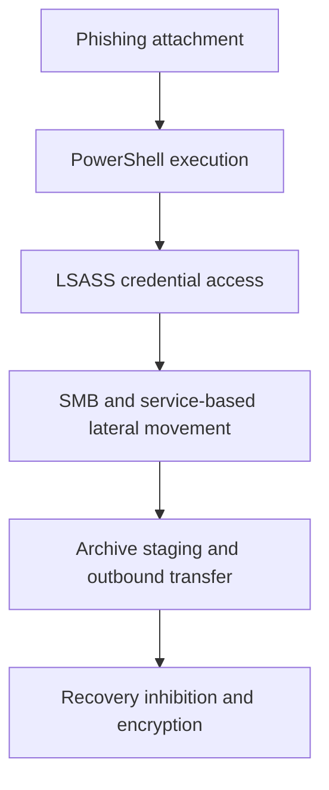
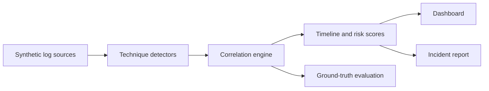

# Operation ShadowVault


An end-to-end SOC and DFIR portfolio lab that reconstructs a simulated ransomware intrusion from multi-source telemetry. The project generates a reproducible dataset, applies MITRE ATT&CK-mapped detections, correlates evidence into an incident timeline, ranks affected assets, evaluates the rules against labelled ground truth, and generates an analyst-ready case report.

> This is a safe defensive simulation. It contains log records describing attacker behavior; it does not contain exploit, credential-dumping, persistence, or encryption functionality.

## What this project demonstrates

- Detection engineering across Windows Security, Sysmon, firewall, and file-system telemetry.
- Alert correlation across five attack stages and multiple hosts.
- MITRE ATT&CK mapping for 11 techniques and sub-techniques.
- SOC triage through severity, evidence, affected-account, and asset context.
- DFIR reporting with IOCs, containment priorities, recovery actions, and analyst confidence.
- Reproducibility through a seeded data generator, labelled ground truth, automated tests, and CI.
- Investigation visualization through an interactive Streamlit dashboard.
- Recruiter-supplied CSV analysis with schema validation and in-memory processing.

## Attack story



The fictional organization, Meridian Precision Manufacturing, is compromised after an Accounts Payable user opens a malicious Office attachment. The activity progresses from execution on `WKS-FIN-07` to credential theft, privileged lateral movement, attempted data exfiltration, shadow-copy deletion, event-log clearing, and mass file renaming.

## Detection coverage

| Stage | ATT&CK coverage | Primary evidence |
|---|---|---|
| Initial access | T1566.001, T1204.002, T1059.001 | Office process spawning obfuscated PowerShell |
| Credential access | T1003.001 | Sysmon Event 10 access to LSASS plus dump artifact |
| Lateral movement | T1021.002, T1569.002 | Network logons across hosts and remote service creation |
| Exfiltration | T1560, T1041 | Archive utility execution and unusually large outbound transfers |
| Impact and anti-forensics | T1490, T1486, T1070.001 | Shadow deletion, rename burst, ransom note, log clearing |

## Verified sample results

| Result | Value |
|---|---:|
| Raw log events | 210 |
| Correlated alerts | 27 |
| Attack stages reconstructed | 5 |
| Named assets with alert evidence | 5 |
| Highest-risk asset | `SRV-FILE-01` |
| Synthetic benchmark precision / recall / F1 | 1.00 / 1.00 / 1.00 |

The evaluation is an exact-match benchmark against the labelled, deterministic lab scenario. It proves that the included rules recover the intended evidence without extra alerts in this dataset; it is not a claim of production accuracy or generalization.

## Architecture



```text
ShadowVault-Pro/
├── .github/workflows/ci.yml       # GitHub Actions test matrix
├── data/
│   ├── raw/                       # four generated telemetry sources
│   ├── ground_truth/              # labelled expected detections
│   └── processed/                 # timeline, scores, summary, metrics
├── docs/
│   ├── MITRE_ATTACK_MAPPING.md
│   └── PORTFOLIO_GUIDE.md
├── notebooks/ShadowVault_Analysis.ipynb
├── reports/incident_report.md
├── src/
│   ├── detectors/                 # five technique-scoped detectors
│   ├── correlation_engine.py
│   ├── evaluate.py
│   ├── log_generator.py
│   └── report_generator.py
├── tests/                         # detector and end-to-end tests
├── dashboard.py
└── run_pipeline.py                # one-command workflow
```

## Run locally

### 1. Create an environment

```bash
python -m venv .venv
```

Windows PowerShell:

```powershell
.venv\Scripts\Activate.ps1
pip install -r requirements-dev.txt
```

macOS or Linux:

```bash
source .venv/bin/activate
pip install -r requirements-dev.txt
```

### 2. Run the complete pipeline

```bash
python run_pipeline.py
```

This regenerates the logs, correlates alerts, evaluates detections, and rebuilds the incident report.

### 3. Run automated tests

```bash
python -m unittest discover -s tests -v
```

### 4. Open the SOC dashboard

```bash
streamlit run dashboard.py
```

The dashboard provides two data modes:

- **Built-in simulation:** explore the included ransomware case and its labelled benchmark.
- **Upload my CSV logs:** upload four compatible telemetry files, validate their schemas, run the same detectors in memory, and download alerts plus a neutral incident report.

Uploaded files do not overwrite the sample dataset. Ground-truth benchmark scores are disabled for custom files because their true labels are unknown.

The investigation view includes stage, severity, and host filters; a timeline; asset risk scores; ATT&CK-stage coverage; evidence review; and CSV/report export.

### Uploaded CSV schemas

The easiest way to test custom data is to export CSVs with the same headers as the four files in `data/raw/`. The dashboard displays every required column before upload. All four sources are required because the rules correlate Windows Security, Sysmon, firewall, and file activity evidence.

## Analyst outputs

- `data/processed/incident_timeline.csv` — normalized, chronological alerts.
- `data/processed/host_risk_scores.csv` — severity-weighted asset ranking.
- `data/processed/attack_chain_summary.csv` — alert count and observed window by stage.
- `data/processed/evaluation_metrics.json` — labelled synthetic benchmark results.
- `reports/incident_report.md` — executive summary, evidence, IOCs, actions, and assessment.

## Design decisions

- **Technique-scoped rules:** each detector targets a documented behavior instead of a vague anomaly score.
- **Corroborating telemetry:** credential access combines a process-access event with a dump artifact; ransomware combines recovery inhibition, file behavior, notes, and anti-forensics.
- **Asset normalization:** firewall IPs are resolved to lab hostnames before risk scoring so the same asset is not counted twice.
- **Transparent evaluation:** expected alerts are versioned separately from detector output and checked in tests.
- **Deterministic generation:** the fixed random seed makes demonstrations, tests, and interview walkthroughs reproducible.

## Limitations

- The dataset is synthetic and represents one attack path.
- The rules are signature and threshold based; they have not been validated on production telemetry.
- Email-gateway evidence, memory forensics, EDR containment, and recovery execution are outside the current lab.
- The risk score supports triage but is not a calibrated probability of compromise.

## Live Demo

[🛡️ Open the ShadowVault SOC Dashboard](https://shadowvault-2jcm5djfdpvf7pmvqr72nu.streamlit.app/)
## License

MIT License. See [`LICENSE`](LICENSE).
